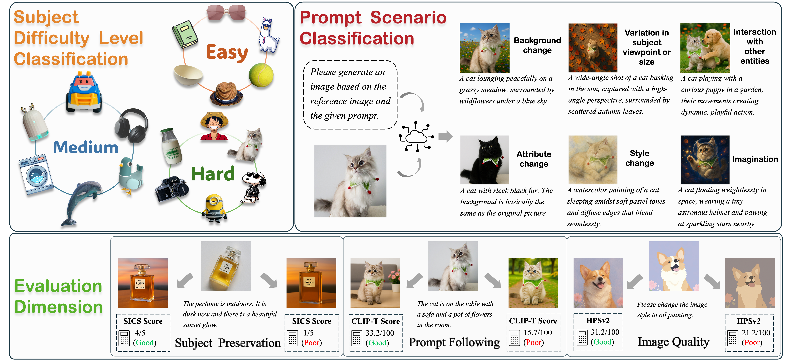

# DSH-Bench: A Difficulty- and Scenario-Aware Benchmark with Hierarchical Subject Taxonomy for Subject-Driven Text-to-Image Generation



Code and Data for DSH-Bench: A Difficulty- and Scenario-Aware Benchmark with Hierarchical Subject Taxonomy for Subject-Driven Text-to-Image Generation

Arxiv: will be made publicly available soon

# 📊 Data
## DSH-Bench Data
The DSH-Bench dataset we collected can be obtained from the following: DSH-bench_data/images 


# SICS model
The model we trained used SICS method can be obtained from the following link:
https://huggingface.co/mapels/DSH-Bench/tree/main

# 🧑‍💻 Code 
1. We have made publicly available the code for all computational metrics used in our experiments, as listed in the directory below: ./code/metric_calculation/
2. The SICS method is implemented based on Llama Factory (https://github.com/hiyouga/LLaMA-Factory).
3. All baseline code we used in our experiment is obtained from official version:
    - Textual Inversion: https://github.com/rinongal/textual_inversion
    - Custom diffusion: https://github.com/adobe-research/custom-diffusion
    - DreamBooth: https://github.com/google/dreambooth
    - λ-Eclipse: http://github.com/eclipse-t2i/lambda-eclipse-inference
    - HiPer: https://github.com/HiPer0/HiPer
    - NeTI: https://github.com/NeuralTextualInversion/NeTI
    - BLIP-Diffusion: https://github.com/salesforce/LAVIS/tree/main/projects/blip-diffusion
    - IP-Adapter: https://github.com/tencent-ailab/IP-Adapter
    - MS-Diffusion: https://github.com/MS-Diffusion/MS-Diffusion
    - OminiControl: https://github.com/Yuanshi9815/OminiControl
    - SSR-Encoder: https://github.com/Xiaojiu-z/SSR_Encoder
    - UNO: https://github.com/bytedance/UNO
    - Emu2: https://github.com/baaivision/Emu
    - RealCustom++: https://github.com/bytedance/RealCustom
    - OmniGen: https://github.com/VectorSpaceLab/OmniGen

# Citation
```
@article{hu2026dsh,
  title={DSH-Bench: A Difficulty-and Scenario-Aware Benchmark with Hierarchical Subject Taxonomy for Subject-Driven Text-to-Image Generation},
  author={Hu, Zhenyu and Wang, Qing and Cao, Te and Liao, Luo and Lu, Longfei and Liu, Liqun and Li, Shuang and Chen, Hang and Xue, Mengge and Chen, Yuan and others},
  journal={arXiv preprint arXiv:2603.08090},
  year={2026}
}
```
